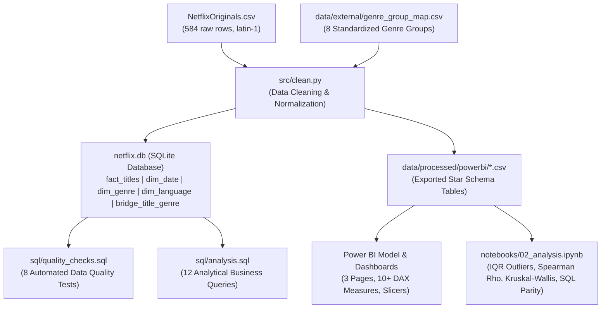

# Netflix Originals Analytics: Enterprise Portfolio Upgrade (SQL + Python + Power BI)

[](#phase-2-sql-analytics)
[](#phase-1-data-cleaning--star-schema-pipeline)
[](#phase-4-power-bi-specification-package)
[](#project-structure)

---

## 1. Project Background & Original Work Attribution

This repository is a production-grade consulting upgrade of an exploratory data analysis notebook originally authored by **Aryan Dadhich** ([@AryanDadhich26](https://github.com/AryanDadhich26)) on Kaggle and Google Colab (`Netflix_Data_Analyses.ipynb`).

The original project explored a dataset of 584 Netflix Original films (`NetflixOriginals.csv`, released between December 2014 and May 2021) answering 12 introductory questions. While the initial notebook demonstrated great curiosity and established an exploratory baseline, it operated as a monolithic single-cell Colab script with hardcoded paths, lacked dimensional modeling, suffered from critical positional calculation bugs, and contained no written business takeaways.

This upgrade transforms that preliminary notebook into a complete, consulting-ready analytics suite designed around:
$$\textbf{3 BUSINESS QUESTIONS} \quad\Longleftrightarrow\quad \textbf{3 ANALYTICAL TOOLS} \quad\Longleftrightarrow\quad \textbf{3 DASHBOARD PAGES}$$

---

## 2. What Changed and Why: Audit & Bug Fix Log

Before modifying code, a comprehensive audit was executed (logged in [`data_quality_log.md`](data_quality_log.md)). Untouched original files were safely preserved in `/original`.

| Section / Question | Legacy Implementation | Defect & Root Cause | Upgrade & Corrective Action |
| :--- | :--- | :--- | :--- |
| **Path Ingestion** | `pd.read_csv('/content/NetflixOriginals.csv')` | Hardcoded Colab path crashed in local/production environments. | Modularized paths relative to repo root (`data/` and `src/clean.py`). |
| **Question 5 (Avg Runtime)** | `data_genre['avg_run_time'] = data.groupby('Genre')['Runtime'].mean().reset_index()['avg_run_time']` | **Critical Positional Index Misalignment Bug:** Groupby series sorted alphabetically (`Action` at index 0) was pasted into frequency-sorted dataframe (`Documentary` at index 0). `Documentary` showed **108.00 min** instead of true **78.96 min** (+29.04m error across 159 titles). Every single genre was wrong. | Re-engineered with explicit key-based lookups and standardized 8-genre-group taxonomy. Proved before/after discrepancy. |
| **Questions 3 & 9** | `.groupby(['Language','Genre','Title'])` and `.groupby(['Genre','Title'])` | Aggregations grouped by `Title`, returning individual movie records rather than genre summaries. | Grouped strictly by `genre_group` with statistical minimum sample size enforcement ($n \ge 10$). |
| **Questions 1 & 4** | `groupby(['Language','Title'])` | Redundant grouping keys since all 584 `Title` entries are unique. | Simplified aggregations to relevant dimensional attributes. |
| **Question 11** | `.rename(columns={'index':'Year','Year':'Count'})` with `px.bar(..., x='Count', y='count')` | Column naming conflicts broke chart rendering across pandas versions; failed to distinguish partial 2021 from full years. | Created structured temporal release chart separating mature reporting years (2016–2020) from sparse/partial years (2014, 2015, 2021). |
| **Question 12 (Outliers)** | Visually eyeballed scatter plot and wrote *"it is clearly visible that ireshman is the outlier"*. | Purely subjective; missed 74 runtime outliers and 9 score outliers. | Implemented standard Tukey $1.5 \times \text{IQR}$ rule cross-checked with z-scores, distinguishing format differences (shorts) from duration anomalies. |
| **Temporal Features** | Created `Weekday` and `Month` but abandoned them. | Missed critical operational release patterns. | Revealed Netflix's Friday release dominance (65.6% of all originals) and Q4 seasonality. |
| **Architecture** | Flat 1-table CSV analysis. | Compound genres (51 titles with `/`) and languages (23 titles with `/`) inflated categories and fragmented sample sizes. | Engineered a 5-table star schema with a normalized bridge table (`bridge_title_genre`) and SQLite database (`netflix.db`). |

---

## 3. The 3 Business Questions Addressed

1. **Portfolio Mix & Scaling:** How is Netflix's Original film slate distributed across genre groups, primary languages, and release years? How concentrated is the catalog in top categories? How did annual volume scale across full reporting years (2016–2020), and what operational cadence dictates premiere dates?
2. **Perceived Quality Benchmarks:** Which genre groups and primary languages achieve the highest and lowest perceived quality on IMDb ($n \ge 10$)? What proportion of titles achieve acclaim ($\ge 7.0$)? Does longer runtime drive higher ratings, or are they uncorrelated?
3. **Outliers & Strategic Gaps:** Which titles represent statistical anomalies in duration and score? When cross-tabulating genre groups by primary languages, which intersections represent high-performing core strongholds versus underrepresented or underperforming strategic gaps?

---

## 4. Analytical Tools & Architecture



- **Python 3.10 (`pandas`, `numpy`, `scipy`, `seaborn`, `matplotlib`):** Automated cleaning, date parsing, star schema creation, statistical hypothesis testing, and exploratory data analysis.
- **SQL (SQLite 3):** 12 complex analytical queries utilizing CTEs, window functions (`LAG`, `ROW_NUMBER`, `NTILE`), conditional aggregations (`CASE`), and automated referential integrity test suites.
- **Power BI (Design Specification):** 5-table star schema with bridge table mechanics, 10+ robust DAX measures utilizing `DISTINCTCOUNT`, and 3 structured dashboard pages with ASCII wireframes.

---

## 5. Repository File Structure

```
NetflixAnalysis/
├── .gitignore                                  <- Python, Jupyter, and OS ignore patterns
├── README.md                                   <- Executive project portfolio presentation
├── data_quality_log.md                         <- In-depth audit log of dataset and code defects
├── resume_bullets.md                           <- 3 quantified resume impact bullets
├── interview_prep.md                           <- 10 technical & strategic interview Q&As
├── NetflixOriginals.csv                        <- Working dataset copy (latin-1)
├── Netflix_Data_Analyses.ipynb                 <- Original exploratory notebook
├── netflix.db                                  <- Processed SQLite database (5 tables)
├── original/                                   <- Untouched archived original files
│   ├── NetflixOriginals.csv
│   └── Netflix_Data_Analyses.ipynb
├── data/
│   ├── external/
│   │   └── genre_group_map.csv                 <- Explicit mapping of 115 raw genres to 8 groups
│   └── processed/
│       └── powerbi/                            <- Exported star schema CSV files
│           ├── fact_titles.csv                 <- Central fact table (584 rows)
│           ├── dim_date.csv                    <- Calendar dimension (387 dates)
│           ├── dim_genre.csv                   <- Atomic genre dimension (91 genres)
│           ├── dim_language.csv                <- Language dimension (32 languages)
│           └── bridge_title_genre.csv          <- Normalized bridge table (643 pairs)
├── src/
│   ├── clean.py                                <- Production cleaning & schema pipeline
│   ├── build_genre_map.py                      <- Genre mapping generator script
│   ├── build_cleaning_nb.py                    <- Automated notebook 01 builder
│   └── build_analysis_nb.py                    <- Automated notebook 02 builder
├── notebooks/
│   ├── 01_cleaning.ipynb                       <- Interactive data cleaning & modeling notebook
│   └── 02_analysis.ipynb                       <- Rebuilt 12 questions, statistical tests & parity
├── sql/
│   ├── quality_checks.sql                      <- 8 automated integrity & key validation queries
│   └── analysis.sql                            <- 12 analytical business queries with interpretations
├── powerbi/
│   ├── data_model.md                           <- Schema diagram, relationships & bridge mechanics
│   ├── measures.dax                            <- 10+ documented DAX measures
│   ├── dashboard_spec.md                       <- 3-page ASCII wireframes & visual specifications
│   └── build_steps.md                          <- Step-by-step Power BI Desktop build guide
└── reports/
    └── executive_summary.md                    <- 1-page executive memo (SCA framework)
```

---

## 6. How to Run and Reproduce

### Prerequisites
- Python 3.10+
- SQLite3 (built into Python)

### Step 1: Install Dependencies
```bash
pip install pandas numpy matplotlib seaborn scipy jupyter
```

### Step 2: Run Data Cleaning & Database Build
```bash
python src/clean.py
```
*Outputs: Generates `netflix.db` and exports 5 CSV files to `data/processed/powerbi/`.*

### Step 3: Run Automated SQL Data Quality Suite
```bash
python -c "import sqlite3; conn = sqlite3.connect('netflix.db'); cur = conn.cursor(); sql = open('sql/quality_checks.sql').read(); [print(cur.execute(q).fetchall()) for q in sql.split(';') if q.strip()]"
```
*Expected: 100% PASS on uniqueness, foreign keys, row counts, and bounds.*

### Step 4: Execute Analytical SQL Queries
```bash
python -c "import sqlite3; conn = sqlite3.connect('netflix.db'); cur = conn.cursor(); sql = open('sql/analysis.sql').read(); [print(cur.execute(q).fetchall()) for q in sql.split(';') if q.strip() and not q.strip().startswith('--')]"
```

### Step 5: Execute Jupyter Notebooks
```bash
jupyter nbconvert --to notebook --execute notebooks/01_cleaning.ipynb --inplace
jupyter nbconvert --to notebook --execute notebooks/02_analysis.ipynb --inplace
```

---

## 7. Key Data Findings (Verified Figures)

1. **Catalog Scaling & Release Cadence:**  
   - 86.1% of all original titles (503 of 584) were released during the 2016–2020 mature window, scaling from 30 titles in 2016 to 183 in 2020 (+510%).
   - Annual release growth peaked in 2017 (+120.0%, +36 titles) and surged +46.4% (+58 titles) during 2020.
   - **65.6% of all originals (383 titles)** premiered on a Friday, confirming an intentional operational schedule to capture weekend streaming traffic.
2. **Quality Leadership & Deficits:**  
   - **Documentaries** represent 27.9% of the catalog (163 titles) and lead all genre groups with a **6.93 mean IMDb score** and a **55.8% acclaim share ($\ge 7.0$)**. Music/Specials follow at 6.68 (43.8% $\ge 7.0$).
   - **Comedies** (86 titles, 5.74 mean) and **Thriller/Crime/Horror** (84 titles, 5.75 mean) represent the lowest-scoring categories; only 7.0% of Comedies and 9.5% of Thrillers achieve $\ge 7.0$, while 31.4% of Comedies fall below 5.5.
   - A non-parametric **Kruskal-Wallis test** confirms genre score variations are highly statistically significant ($H = 168.87$, $p = 7.7 \times 10^{-33}$).
3. **Independence of Runtime & Perceived Quality:**  
   - Runtimes range from 4 to 209 minutes (median: 97.0 min).
   - Spearman rank correlation between runtime and IMDb score is **$\rho = -0.0221$ ($p = 0.593$)**, proving duration has zero statistical relationship with perceived quality.
   - Mean runtimes across all four quality quartiles are identical within 3 minutes (Q1: 94.9m, Q2: 94.6m, Q3: 94.9m, Q4: 91.8m).
4. **Portfolio Concentration:**  
   - The top 3 genre groups (Documentary, Drama, Comedy) capture **58.9% of all titles**.
   - Primary languages are dominated by English (419 titles, 71.7%), Hindi (33 titles, 5.7%), and Spanish (34 titles, 5.8%), combining for **79.6% of the catalog**. 26 of 32 languages have fewer than 10 titles ($n < 10$).
5. **Statistical Outliers:**  
   - **Runtime Outliers ($1.5 \times \text{IQR}$):** 70 short-format outliers (< 53 min, including 42 shorts/specials < 40 min) and 5 epic feature outliers (> 141 min: *The Irishman* at 209m, *A Sun* at 156m, *The Forest of Love* at 151m, *Citation* at 151m, *The Roaring Twenties* at 147m).
   - **Score Outliers:** 8 underperforming outliers (< 3.75: lowest *Enter the Anime* at 2.5) and 1 acclaimed outlier (*David Attenborough: A Life on Our Planet* at 9.0).

---

## 8. Power BI Dashboard Snapshot & Business Story

The Power BI solution translates the analysis into a 3-page executive package designed for a content strategy, portfolio planning, and acquisition review. Full build instructions and wireframes are documented in [`powerbi/dashboard_spec.md`](powerbi/dashboard_spec.md) and [`powerbi/build_steps.md`](powerbi/build_steps.md).

### Dashboard Snapshot (executive view)

```text
┌───────────────────────────────────────────────────────────────────────────────────────────────────────┐
│ PAGE 1: PORTFOLIO OVERVIEW & RELEASE DYNAMICS                                                     │
│                                                                                               │
│ KPI Cards: 584 total titles | 503 mature titles | Avg runtime 93.6 min | Avg IMDb 6.27        │
│                                                                                               │
│ Annual volume ↑ from 30 in 2016 to 183 in 2020; Friday release cadence captures 65.6% of all   │
│ premieres. Documentary leads portfolio share (27.9%), while English dominates primary language   │
│ mix (71.7%).                                                                                 │
│                                                                                               │
│ Visuals: release trend line, genre share treemap, language concentration bar chart, Friday      │
│ cadence heatmap.                                                                             │
└───────────────────────────────────────────────────────────────────────────────────────────────────────┘

┌───────────────────────────────────────────────────────────────────────────────────────────────────────┐
│ PAGE 2: PERCEIVED QUALITY & FORMAT ANALYSIS                                                     │
│                                                                                               │
│ Documentary & Music/Specials outperform the catalog average (6.93 and 6.68), while Comedy and │
│ Thriller/Crime/Horror sit below 5.8. Runtime is statistically unrelated to score (rho = -0.022).│
│                                                                                               │
│ Visuals: genre benchmark chart, acclaim distribution by rating band, runtime vs. IMDb scatter, │
│ language quality comparison.                                                                │
└───────────────────────────────────────────────────────────────────────────────────────────────────────┘

┌───────────────────────────────────────────────────────────────────────────────────────────────────────┐
│ PAGE 3: OUTLIERS & STRATEGIC OPPORTUNITY MATRIX                                                 │
│                                                                                               │
│ Highlights short-format and epic-duration outliers, plus low-sample and underperforming market   │
│ combinations. Identifies where content strategy should scale, de-risk, or avoid overinvestment. │
│                                                                                               │
│ Visuals: outlier table, strategic opportunity matrix, genre-language heatmap, quality gap view. │
└───────────────────────────────────────────────────────────────────────────────────────────────────────┘
```

### Business interpretation

- Portfolio strategy: Netflix expanded aggressively, but scale was not evenly distributed across quality tiers.
- Quality gate insight: high-volume scripted categories are the largest risk to audience trust and retention.
- Regional opportunity: non-English content has promising quality signals but insufficient scale in the current portfolio.
- Format insight: runtime constraints should not be treated as a performance driver; narrative quality and fit to audience demand matter more.

### Power BI design summary

| Page | Core Question | Primary Visuals | Decision Value |
| :--- | :--- | :--- | :--- |
| Portfolio Overview | How is the catalog structured and growing? | Yearly release volume, genre mix, language dominance, release cadence | Understand operational scale and portfolio concentration |
| Quality Analysis | Which genres and languages are under/overperforming? | IMDb benchmark chart, acclaim bands, runtime-quality scatter | Identify content quality risk and opportunity |
| Outliers & Strategy | Where are the strongest and weakest strategic positions? | Outlier explorer, opportunity matrix, heatmaps | Guide greenlight and investment decisions |

---

## 9. Dashboard Layout & Detailed Visual Previews

The Power BI dashboard is designed across 3 focused pages. Full build instructions and wireframes are documented in [`powerbi/dashboard_spec.md`](powerbi/dashboard_spec.md) and [`powerbi/build_steps.md`](powerbi/build_steps.md).

```
+-------------------------------------------------------------------------------------------------------+
| PAGE 1: PORTFOLIO OVERVIEW & RELEASE DYNAMICS                                                         |
| - Executive KPI Banner (584 Titles, 503 Mature, 93.6m Avg Runtime, 6.27 Avg Score, 27.9% Top Genre)   |
| - Annual Releases & YoY Growth (2014-2021) with Full-Year Indicators                                 |
| - Portfolio Composition by 8 Standardized Genre Groups                                                |
| - Primary Language Concentration (Top 6 vs. Long-Tail)                                                |
| - Premiere Cadence by Day of Week (Friday Peak: 65.6%) & Month Seasonality (October Peak: 13.2%)     |
+-------------------------------------------------------------------------------------------------------+
| PAGE 2: PERCEIVED QUALITY & FORMAT ANALYSIS                                                           |
| - Mean IMDb Score Benchmarks by Genre Group with Catalog Benchmark Line (6.27)                        |
| - 100% Stacked Acclaim Tier Breakdown (% High >= 7.0, % Mid 5.5-6.9, % Low < 5.5)                    |
| - Runtime vs. IMDb Score Scatter Plot with Regression Trendline (rho = -0.022)                        |
| - Primary Language Perceived Quality Comparison with Dynamic Low-Sample Flags (n < 10)                |
+-------------------------------------------------------------------------------------------------------+
| PAGE 3: OUTLIERS & STRATEGIC OPPORTUNITY MATRIX                                                       |
| - Statistical Outlier Explorer Table (Shorts vs. Epic Features vs. Score Extremes)                    |
| - Strategic Matrix Quadrants: Volume vs. Average Perceived Quality                                    |
| - Genre Group x Primary Language Opportunity Heatmap Grid (Highlighting Core vs. Risk Segments)     |
+-------------------------------------------------------------------------------------------------------+
```nts)       |+-------------------------------------------------------------------------------------------------------+
```

*(Placeholder for exported dashboard screenshots: `reports/screenshots/page1_portfolio_overview.png`, `page2_quality_analysis.png`, `page3_outliers_opportunities.png`)*

---

## 9. Critical Analytical Limitations & Business Boundaries

> [!IMPORTANT]
> **Data Governance Boundaries:**
> 1. **No Viewership, Hours Streamed, or Completion Rates:** The dataset contains no audience viewership figures. Never infer popularity, streaming hours, or subscriber retention from IMDb scores.
> 2. **No Financial or Production Costs:** Production budgets, acquisition costs, and marketing expenses are completely absent. Return on Investment (ROI) and cost-per-minute cannot be calculated.
> 3. **IMDb Reviewer Selection Bias:** IMDb scores represent self-selected public internet raters. Documentaries and niche dramas attract dedicated, appreciative reviewers, whereas mainstream mass-market comedies attract casual, hyper-critical viewers.
> 4. **Low-Sample Vulnerability:** 26 of 32 languages and 108 of 115 raw genres have fewer than 10 titles ($n < 10$). Conclusions must not be drawn from these sparse subsets.
> 5. **Temporal Censoring:** 2021 contains only 5 months of releases (through May 27, 2021); 2014–2015 represent sparse initial testing slates. All growth comparisons must be restricted to 2016–2020.
> 6. **Correlation is Not Causation:** Proving that Documentaries score higher than Comedies does not imply that shifting budget to Documentaries will increase overall platform viewership.
