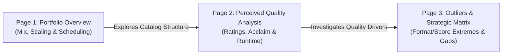

# Power BI Dashboard Specification: Netflix Originals Analytics

**Project:** Netflix Originals Analytics Portfolio Upgrade  
**Author:** Data Strategy & Analytics  
**Framework:** 3 Questions, 3 Tools, 3 Dashboard Pages  
**Target Resolution:** Standard 16:9 widescreen (1280 x 720 or 1920 x 1080)  

---

## Executive Architecture Overview



---

## Page 1: Portfolio Overview & Release Dynamics

### 1. Business Question Addressed
> **Business Question 1 (Portfolio Mix):** How is Netflix's Original film portfolio distributed across standardized genre groups, primary languages, and calendar years? How concentrated is the catalog in top categories, and what operational cadence dictates premiere dates?

### 2. ASCII Wireframe Layout

```
+-------------------------------------------------------------------------------------------------------+
|  NETFLIX ORIGINALS: PORTFOLIO OVERVIEW & RELEASE DYNAMICS                           [Page 1 of 3]     |
+-------------------------------------------------------------------------------------------------------+
|  FILTERS: [Year: All (2014-2021) v]  [Full Years Only: All v]  [Genre Group: All v]  [Language: All v]|
+-------------------+-------------------+-------------------+-------------------+-----------------------+
|  TOTAL TITLES     |  MATURE RELEASES  |  AVG RUNTIME      |  AVG IMDB SCORE   |  TOP GENRE SHARE      |
|      584          |  503 (86.1%)      |  93.6 min         |      6.27         |  27.9% (Doc)          |
+-------------------+-------------------+-------------------+-------------------+-----------------------+
| [VISUAL 1: Stacked Bar Chart]                         | [VISUAL 2: Donut / Bar Chart]                 |
| Annual Release Volume & YoY Trajectory                | Portfolio Composition by Genre Group          |
|                                                       |                                               |
| Titles                                                | Documentary (163, 27.9%)                      |
| 200 |                        [ 183 ] (+46%)           | Drama (95, 16.3%)                             |
| 150 |               [ 124 ] (+26%)                    | Comedy (86, 14.7%)                            |
| 100 |         [ 99 ] (+50%)                           | Thriller/Horror (84, 14.4%)                   |
|  50 |   [ 66 ] (+120%)           [ 71*] (Partial)     | Romance (57, 9.8%)                            |
|   0 +----+-----+----+-----+-----+----+----            | Sci-Fi/Animation (46, 7.9%)                   |
|     2015 2016  2017 2018  2019  2020 2021             | Music/Special (32, 5.5%)                      |
|     *Red bars indicate sparse/partial periods         | Action/Other (21, 3.6%)                       |
+-------------------------------------------------------+-----------------------------------------------+
| [VISUAL 3: Horizontal Bar Chart]                      | [VISUAL 4: Column Heatmap / Rhythm]           |
| Primary Language Concentration (Top 6 + Long-Tail)    | Premiere Cadence by Day of Week & Month       |
|                                                       |                                               |
| English    |========================| 419 (71.7%)     | Friday:   [====================] 383 (65.6%)  |
| Hindi      |==| 33 (5.7%)                             | Wednesday:[====] 82 (14.0%)                   |
| Spanish    |==| 34 (5.8%)                             | Thursday: [===] 59 (10.1%)                    |
| French     |=| 20 (3.4%)                              | Tuesday:  [=] 29 (5.0%)                       |
| Italian    |=| 14 (2.4%)                              | Mon/Weekend combined: 31 (5.3%)               |
| Portuguese |=| 12 (2.1%)                              |                                               |
| Other (26) |===| 52 (8.9%)                            | Peak Month: October (77 titles, 13.2%)        |
+-------------------------------------------------------+-----------------------------------------------+
```

### 3. Visual Specifications

| Visual Name | Chart Type | Fields / Dimensions | Measures Used | Insight / Question Answered |
| :--- | :--- | :--- | :--- | :--- |
| **KPI Banner** | Card Row | `N/A` | `[Total Titles]`, `[Mature Period Titles]`, `[Avg Runtime]`, `[Avg IMDb Score]`, `[Top Genre Share %]` | High-level executive volume, perceived quality, and duration baseline. |
| **Visual 1: Annual Trajectory** | Clustered Column Chart | X: `dim_date[year]`, Legend: `dim_date[is_full_year]` | `[Total Titles]`, `[Titles YoY Growth %]` (Tooltip) | Shows exponential catalog expansion (peak 183 in 2020) while visually flagging incomplete periods. |
| **Visual 2: Genre Group Mix** | Donut Chart or Treemap | Category: `fact_titles[genre_group]` | `[Total Titles]`, `% Share of Total` | Exposes catalog weighting: Non-fiction (Documentary) is #1 with 27.9% of the catalog. |
| **Visual 3: Language Concentration** | Bar Chart (Horizontal) | Y: `dim_language[language_name]` | `[Total Titles]`, `% Share of Total` | Proves catalog dependence: English + Hindi + Spanish control 79.6% of titles. |
| **Visual 4: Release Cadence** | Clustered Bar / Heatmap | Y: `dim_date[weekday_name]`, X: `[Total Titles]` | `[Total Titles]`, `[Avg IMDb Score]` | Discloses Netflix's core weekend binge strategy: 65.6% premiere on Friday. |

---

## Page 2: Perceived Quality & Format Analysis

### 1. Business Question Addressed
> **Business Question 2 (Perceived Quality):** Which content groups achieve the highest perceived quality on IMDb, and which face persistent quality deficits? What share of titles clear the 7.0 acclaim benchmark? Does longer runtime correlate with higher ratings?

### 2. ASCII Wireframe Layout

```
+-------------------------------------------------------------------------------------------------------+
|  NETFLIX ORIGINALS: PERCEIVED QUALITY & FORMAT BENCHMARKS                           [Page 2 of 3]     |
+-------------------------------------------------------------------------------------------------------+
|  FILTERS: [Genre Group: All v]  [Language: All v]  [Runtime Bucket: All v]  [Min Titles >= 10: Yes v] |
+-------------------------------------------------------+-----------------------------------------------+
| [VISUAL 5: Grouped Bar & KPI Reference]               | [VISUAL 6: 100% Stacked Bar]                  |
| Average IMDb Score by Genre Group (n >= 10)           | Acclaim Tier Breakdown (% High vs Low Rated)  |
|                                                       |                                               |
| Documentary            |=========| 6.93               | Doc:     [==== High 55.8% ====][ Mid ][Low 4%] |
| Music/Concert/Special  |========| 6.68                | Music:   [=== High 43.8% ===][  Mid   ][Low 6%]|
| Drama                  |=======| 6.37                 | Drama:   [= 20% =][====== Mid 63% ======][Low] |
| Sci-Fi/Animation       |======| 6.05                  | Sci-Fi:  [= 20% =][====== Mid 61% ======][Low] |
| Romance                |======| 5.90                  | Romance: [4%][========= Mid 68% ========][28%]|
| Action/Other           |======| 5.87                  | Comedy:  [7%][======= Mid 62% ========][31%!] |
| Thriller/Crime/Horror  |=====| 5.75                   | Thriller:[9%][======= Mid 55% ========][36%!] |
| Comedy                 |=====| 5.74                   |                                               |
|   -- Dotted line: Catalog Average = 6.27 --           | Green: >= 7.0 | Gray: 5.5-6.9 | Red: < 5.5    |
+-------------------------------------------------------+-----------------------------------------------+
| [VISUAL 7: Scatter Plot with Regression Trendline]                                                    |
| Runtime (Minutes) vs. Perceived Quality (IMDb Score)                                                  |
|                                                                                                       |
| IMDb Score                                                                                            |
| 10 |                                                                                                  |
|  9 |        * (Attenborough: 9.0)                                                                     |
|  8 |            * *   *  *  *  *                                                                      |
|  7 |  ----------------------------------------------- [High Acclaim Floor = 7.0] ------------------- |
|  6 |    * *  * * * * * * * * * * * * * * * * * *                                                      |
|  5 |  ----------------- Trendline: Spearman rho = -0.022 (Statistically Uncorrelated) -------------- |
|  4 |             * *   *   *    *                                                                     |
|  3 |        * (Enter the Anime: 2.5)                                       * (The Irishman: 209m, 7.3)|
|    +--------+------------------+-----------------------+-------------------+--------------------+     |
|    0       40m (Shorts)       80m                    120m                160m                 210m    |
+-------------------------------------------------------------------------------------------------------+
```

### 3. Visual Specifications

| Visual Name | Chart Type | Fields / Dimensions | Measures Used | Insight / Question Answered |
| :--- | :--- | :--- | :--- | :--- |
| **Visual 5: Genre Score Benchmark** | Bar Chart with Target Line | Y: `fact_titles[genre_group]`, Target Line: `6.27` | `[Avg IMDb Score]`, `[Sample Reliability Badge]` | Documents that Documentaries (6.93) and Music/Specials (6.68) lead quality; Comedy (5.74) is lowest. |
| **Visual 6: Acclaim Segmentation** | 100% Stacked Bar Chart | Y: `fact_titles[genre_group]`, Legend: `fact_titles[score_bucket]` | `[% High-Rated Titles]`, `[% Low-Rated Titles]` | Highlights acute quality risks: 35.7% of Thrillers and 31.4% of Comedies score below 5.5. |
| **Visual 7: Runtime vs. Score** | Scatter Plot with Trendline | X: `fact_titles[runtime]`, Y: `fact_titles[imdb_score]`, Details: `title` | `Avg Runtime`, `Avg IMDb Score`, `[Sample Reliability Badge]` | Proves that duration is statistically independent of quality ($\rho = -0.022$, $p = 0.593$). |

---

## Page 3: Outliers & Strategic Opportunity Matrix

### 1. Business Question Addressed
> **Business Question 3 (Outliers & Strategic Gaps):** Which titles represent statistical anomalies in duration or perceived quality? When intersecting genre groups with primary languages, where are Netflix's core strongholds and strategic vulnerability gaps?

### 2. ASCII Wireframe Layout

```
+-------------------------------------------------------------------------------------------------------+
|  NETFLIX ORIGINALS: OUTLIERS & STRATEGIC OPPORTUNITY MATRIX                         [Page 3 of 3]     |
+-------------------------------------------------------------------------------------------------------+
|  FILTERS: [Outlier Type: All v]  [Genre Group: All v]  [Language: All v]  [Sample Filter: n >= 3 v]   |
+-------------------------------------------------------+-----------------------------------------------+
| [VISUAL 8: Statistical Outlier Explorer Table]        | [VISUAL 9: Strategic Matrix (Genre x Lang)]   |
| Confirmed IQR & Z-Score Anomalies                     | Opportunity Quadrants (Volume vs. Quality)    |
|                                                       |                                               |
| Title               | Format  | RT   | Score | Type   | English Doc:     [137 titles | 6.95] (Core)   |
| The Irishman        | Feature | 209m | 7.3   | Long   | English Drama:   [ 58 titles | 6.47] (Core)   |
| A Sun               | Feature | 156m | 7.6   | Long   | Hindi Drama:     [ 15 titles | 6.13] (Mod)    |
| The Forest of Love  | Feature | 151m | 6.3   | Long   | Spanish Drama:   [ 13 titles | 6.54] (Opp)    |
| Canvas              | Short   |  9m  | 6.4   | Short  | English Thriller:[ 67 titles | 5.76] (RISK)   |
| Sol Levante         | Short   |  4m  | 4.7   | Short  | English Comedy:  [ 65 titles | 5.75] (RISK)   |
| Attenborough: Planet| Feature | 83m  | 9.0   | Acclaim| French Thriller: [  7 titles | 5.67] (Risk)   |
| Enter the Anime     | Feature | 58m  | 2.5   | Flop   | Spanish Comedy:  [  7 titles | 5.46] (Risk)   |
+-------------------------------------------------------+-----------------------------------------------+
| [VISUAL 10: Matrix Heatmap Grid]                                                                      |
| Perceived Quality Heatmap by Genre Group (Rows) and Primary Language (Columns) (n >= 3)              |
|                                                                                                       |
| Genre Group \ Lang | English  | Spanish  | Hindi    | French   | Italian  | Portuguese | Japanese |
| Documentary        |   6.95   |   6.70   |   6.80   |   6.40   |   6.70   |   6.90     |   6.70   |
| Drama              |   6.47   |   6.54   |   6.13   |   6.15   |   5.50   |   5.80     |   6.30   |
| Sci-Fi/Animation   |   6.28   |   --     |   --     |   --     |   --     |   --       |   6.55   |
| Music/Special      |   6.73   |   5.70   |   --     |   --     |   --     |   --       |   --     |
| Romance            |   5.94   |   5.88   |   5.00   |   6.00   |   --     |   5.70     |   --     |
| Thriller/Crime/Hor |   5.76   |   5.98   |   5.45   |   5.67   |   5.45   |   --       |   --     |
| Comedy             |   5.75   |   5.46   |   6.02   |   5.45   |   5.40   |   6.00     |   --     |
|   Green >= 6.5 (Acclaimed) | Yellow 6.0-6.4 (Solid) | Red < 6.0 (Underperforming)                    |
+-------------------------------------------------------------------------------------------------------+
```

### 3. Visual Specifications

| Visual Name | Chart Type | Fields / Dimensions | Measures Used | Insight / Question Answered |
| :--- | :--- | :--- | :--- | :--- |
| **Visual 8: Outlier Explorer** | Table Visual with Conditional Icons | `title`, `genre_group`, `primary_language`, `runtime`, `imdb_score`, `runtime_bucket`, `score_bucket` | `[Avg Runtime]`, `[Avg IMDb Score]` | Transparently separates format differences (shorts) from genuine content anomalies. |
| **Visual 9: Strategic Matrix** | Scatter / Quadrant Bubble Chart | X: `[Total Titles]`, Y: `[Avg IMDb Score]`, Details: `genre_group` & `primary_language` | `[Total Titles]`, `[Avg IMDb Score]` | Positions content portfolios into 4 strategic quadrants: Core Strongholds, Opportunities, Niche, and Quality Vulnerabilities. |
| **Visual 10: Opportunity Heatmap** | Matrix Visual with Conditional Background Color | Rows: `fact_titles[genre_group]`, Columns: `fact_titles[primary_language]` | Values: `[Avg IMDb Score]`, Tooltip: `[Total Titles]` | Uncovers high-performing expansion targets (Spanish Drama 6.54) vs systemic risks (English Comedy 5.75). |

---

## 4. Global Slicers & Interactivity Guidelines
- **Sync Slicers:** `dim_date[year]` and `fact_titles[primary_language]` must be synced across Pages 1, 2, and 3.
- **Cross-Filtering:** Selecting a genre group on Page 1 cross-highlights the language bar chart and release cadence.
- **Tooltips:** Custom report page tooltips on Page 2 display title counts, sample reliability badge, and top-rated title for any hovered genre or language.
