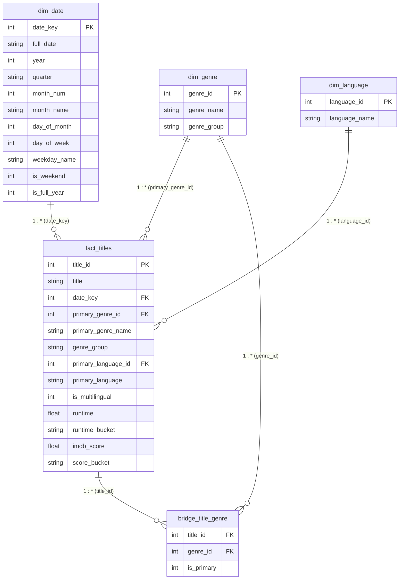

# Power BI Data Model Architecture: Netflix Originals

**Project:** Netflix Originals Analytics Portfolio Upgrade  
**Author:** Data Strategy & Analytics  
**Target File / Engine:** Power BI Desktop (Star Schema with Normalized Bridge)  
**Processed Data Source:** `data/processed/powerbi/*.csv`  

---

## 1. Schema Diagram



---

## 2. Table Specifications & Grain

### 1. `fact_titles` (Central Fact Table)
- **File:** `data/processed/powerbi/fact_titles.csv`
- **Grain:** One row per unique Netflix Original title (584 records).
- **Primary Key:** `title_id` (Integer, 1 to 584).
- **Foreign Keys:**
  - `date_key` $\rightarrow$ `dim_date[date_key]`
  - `primary_genre_id` $\rightarrow$ `dim_genre[genre_id]`
  - `primary_language_id` $\rightarrow$ `dim_language[language_id]`
- **Measures / Numerical Fields:** `runtime`, `imdb_score`.
- **Analytical Dimensions:** `primary_genre_name`, `genre_group`, `primary_language`, `is_multilingual`, `runtime_bucket`, `score_bucket`.

### 2. `dim_date` (Calendar Dimension)
- **File:** `data/processed/powerbi/dim_date.csv`
- **Grain:** One row per distinct premiere calendar date (387 records).
- **Primary Key:** `date_key` (Format: `YYYYMMDD`, e.g., `20201002`).
- **Attributes:** `full_date`, `year`, `quarter`, `month_num`, `month_name`, `day_of_month`, `day_of_week`, `weekday_name`, `is_weekend`, `is_full_year`.
- **Note:** `is_full_year = 1` restricts analysis to mature reporting periods (2016–2020: 503 titles), excluding sparse (2014, 2015) and partial (2021) years.

### 3. `dim_genre` (Genre Dimension)
- **File:** `data/processed/powerbi/dim_genre.csv`
- **Grain:** One row per atomic unique genre (91 records).
- **Primary Key:** `genre_id` (Integer, 1 to 91).
- **Attributes:** `genre_name`, `genre_group` (mapped to 8 strategic categories).

### 4. `dim_language` (Language Dimension)
- **File:** `data/processed/powerbi/dim_language.csv`
- **Grain:** One row per distinct atomic language (32 records).
- **Primary Key:** `language_id` (Integer, 1 to 32).
- **Attributes:** `language_name`.

### 5. `bridge_title_genre` (Many-to-Many Bridge Table)
- **File:** `data/processed/powerbi/bridge_title_genre.csv`
- **Grain:** One row per title-to-atomic-genre pairing (643 records).
- **Composite Key:** (`title_id`, `genre_id`).
- **Attributes:** `is_primary` (1 if first listed in source title, 0 for secondary/hybrid tags).

---

## 3. Relationships & Cardinality Configuration

Configure the model relationships in Power BI Model View as follows:

| From Table | From Column | To Table | To Column | Cardinality | Cross Filter Direction | Security Filter | Active? |
| :--- | :--- | :--- | :--- | :---: | :---: | :---: | :---: |
| `dim_date` | `date_key` | `fact_titles` | `date_key` | 1 to Many (`1:*`) | Single (`dim_date` filters `fact_titles`) | None | **Yes** |
| `dim_language` | `language_id` | `fact_titles` | `primary_language_id` | 1 to Many (`1:*`) | Single (`dim_language` filters `fact_titles`) | None | **Yes** |
| `dim_genre` | `genre_id` | `fact_titles` | `primary_genre_id` | 1 to Many (`1:*`) | Single (`dim_genre` filters `fact_titles`) | None | **Yes** |
| `dim_genre` | `genre_id` | `bridge_title_genre` | `genre_id` | 1 to Many (`1:*`) | Single (`dim_genre` filters `bridge_title_genre`) | None | **Yes** |
| `fact_titles` | `title_id` | `bridge_title_genre` | `title_id` | 1 to Many (`1:*`) | Single (`fact_titles` filters `bridge_title_genre`) | None | **Yes** |

---

## 4. Bridge Table Mechanics & Distinct Counting Rule

### The Multi-Genre Double-Counting Risk
51 titles in the catalog feature compound genres (e.g., `Anime / Short`, `Action/Science fiction`). In the normalized model, a title associated with 2 genres generates 2 rows in `bridge_title_genre`.
- If an analyst performs a simple row count `COUNTROWS(fact_titles)` or `COUNT(fact_titles[title_id])` while filtering across the bridge, multi-genre titles will be counted multiple times, artificially inflating the total catalog count from **584** to **643**.

### Best-Practice Modeling Solution
1. **Maintain Single-Direction Filtering:**  
   Do **NOT** set bidirectional cross-filtering between `bridge_title_genre` and `fact_titles`. Bidirectional relationships introduce ambiguity, slow DAX engine performance, and risk circular relationship paths.
2. **Enforce `DISTINCTCOUNT` in DAX Measures:**  
   All title aggregation measures must utilize `DISTINCTCOUNT(fact_titles[title_id])`.
3. **Bridge Traversal Pattern:**  
   When slicing by `dim_genre` through the bridge table, use `CALCULATE` with `CROSSFILTER` or `TREATAS`:
   ```dax
   Titles by All Tagged Genres = 
   CALCULATE(
       DISTINCTCOUNT(fact_titles[title_id]),
       CROSSFILTER(fact_titles[title_id], bridge_title_genre[title_id], Both)
   )
   ```
   This guarantees that if a film is tagged as both `Action` and `Comedy`, it appears under `Action` when viewed separately, under `Comedy` when viewed separately, but is counted **exactly once** in portfolio totals.
