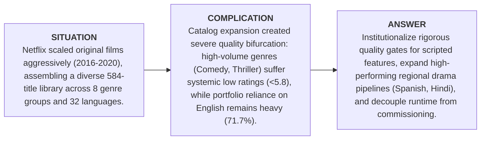

# Executive Summary: Netflix Originals Content Strategy Deep Dive

**To:** Content Strategy & Acquisition Committee  
**From:** Senior Data & Analytics Consultant  
**Date:** September 2026  
**Scope:** 584 Netflix Original Titles (December 2014 – May 2021)  
**Methodology:** SQL (SQLite Star Schema), Python (Non-Parametric Statistical Testing), Power BI Architecture  

---

## 1. Executive Briefing: The SCA Framework

### Situation
Between 2016 and 2020, Netflix transitioned from a streaming distributor into a global production powerhouse, expanding original feature releases from 30 titles in 2016 to 183 in 2020 (+510% 5-year growth). The resulting 584-title portfolio spans 8 high-level genre categories and 32 languages. Operations standardized around a weekend binge-viewing premiere cadence, with 65.6% of all originals (383 titles) releasing on Fridays.

### Complication
Catalog volume growth came at the expense of perceived quality in core commercial genres:
1. **Quality Bifurcation:** High-volume scripted categories like Comedy (86 titles, 5.74 average IMDb score) and Thriller/Crime/Horror (84 titles, 5.75 average) demonstrate persistent quality vulnerabilities, with over 31% of titles scoring below 5.5 and fewer than 10% achieving critical acclaim ($\ge 7.0$).
2. **Catalog Concentration:** The portfolio remains heavily dependent on English (71.7% primary share). 26 of 32 languages represent low-sample long-tail experiments ($n < 10$).
3. **Format Dispersion:** 42 titles (7.2%) are shorts/specials (< 40 min) commingled with standard features, while duration itself has zero relationship with audience ratings ($\rho = -0.022$).

### Answer
Netflix content strategy must pivot from unconstrained volume to targeted portfolio optimization: establish rigorous pre-greenlight quality filters in scripted entertainment, scale under-leveraged regional drama hubs that demonstrate high quality (e.g., Spanish Drama averaging 6.54), and eliminate arbitrary film duration constraints.

---

## 2. Key Data Insights (Computed & Verified)

| # | Strategic Finding | Key Verified Metrics | Business Implication |
| :-: | :--- | :--- | :--- |
| **1** | **Exponential Scaling & Friday Cadence** | **503 of 584 titles (86.1%)** were released during the 2016–2020 mature window. Releases surged **+120.0% in 2017** (+36 titles) and **+46.4% in 2020** (+58 titles). **65.6% (383 titles)** premiere on Fridays. | Content release operations are tightly optimized for weekend consumer binging, successfully delivering steady weekly engagement volume. |
| **2** | **Documentary & Special Quality Leadership** | Documentaries represent **27.9% of catalog volume (163 titles)** with a platform-leading **6.93 mean IMDb score** and **55.8% acclaim share ($\ge 7.0$)**. Music/Specials follow at **6.68 mean (43.8% $\ge 7.0$)**. | Non-fiction acquisitions serve as the platform's primary brand equity driver and critical acclaim anchor. |
| **3** | **Scripted Light Entertainment Deficit** | Comedy (**86 titles, 5.74 mean**) and Thriller/Crime/Horror (**84 titles, 5.75 mean**) score lowest. Only **7.0% of Comedies** and **9.5% of Thrillers** reach $\ge 7.0$. **31.4% of Comedies** fall below 5.5. | High churn risk: mass-audience scripted content frequently disappoints perceived quality expectations. |
| **4** | **Linguistic Concentration** | Top 3 languages (English: 419, Spanish: 34, Hindi: 33) capture **79.6% of the catalog**. **26 of 32 languages** have fewer than 10 titles. | Global expansion remains nascent; most non-English slates lack critical mass to evaluate systematic performance. |
| **5** | **Independence of Runtime & Quality** | Spearman correlation between runtime and IMDb score is **$\rho = -0.0221$ ($p = 0.593$)**. Feature runtimes span 4 to 209 minutes (median: 97.0 min). | Duration is statistically independent of perceived quality. Mandating specific runtimes does not enhance ratings. |

---

## 3. Strategic Recommendations & Operating Assumptions

### Recommendation 1: Re-architect Scripted Comedy & Thriller Quality Gates
- **Action:** Introduce stringent pre-production script evaluation, audience preview testing, and director track-record thresholds for Comedy and Thriller/Crime/Horror slates before greenlighting full-budget productions.
- **Underlying Business Assumption:** Viewers experience content fatigue and brand erosion when mass-market scripted entertainment frequently scores below 6.0; lifting perceived quality will reduce churn and enhance subscriber lifetime value.

### Recommendation 2: Scale High-Performing Regional Non-English Drama Hubs
- **Action:** Reallocate 15–20% of underperforming English mid-budget comedy capital toward regional drama hubs in Latin America/Spain (Spanish Drama: 6.54 mean score) and India (Hindi productions: 115.7 min runtime, strong narrative density).
- **Underlying Business Assumption:** High perceived quality in domestic productions translates into strong subscriber acquisition within local markets and cross-border streaming appeal via dubbing/subtitling.

### Recommendation 3: Eliminate Prescriptive Runtime Mandates in Commissioning
- **Action:** Grant creative teams flexibility in runtime format without artificial platform length minimums, treating short-format specials (< 40m) as brand-building companion assets rather than feature substitutes.
- **Underlying Business Assumption:** Viewers evaluate narrative pacing and thematic resonance rather than minutes on screen; eliminating arbitrary duration restrictions reduces bloated production costs.

---

## 4. Analytical Limitations & Governance Guardrails

> [!CAUTION]
> **Essential Analytical Limitations:**
> 1. **No Viewership or Engagement Metrics:** The dataset contains no hours viewed, household reach, completion rates, or subscriber acquisition figures. A high IMDb score does not imply commercial streaming success.
> 2. **No Budget or Revenue Fields:** Production, licensing, and marketing costs are absent. Return on Investment (ROI) and cost-per-stream cannot be calculated.
> 3. **IMDb Reviewer Selection Bias:** Ratings represent public user reviews on IMDb, which systematically favor niche auteur documentaries and penalize formulaic mass comedies.
> 4. **Low-Sample Vulnerability:** 26 languages and 108 raw genres have fewer than 10 titles ($n < 10$). Conclusions must not be generalized from these sparse categories.
> 5. **Temporal Censoring:** 2021 represents only 5 months of data (through May 27), and 2014–2015 represent sparse initial testing slates. All growth metrics must be restricted to 2016–2020.
